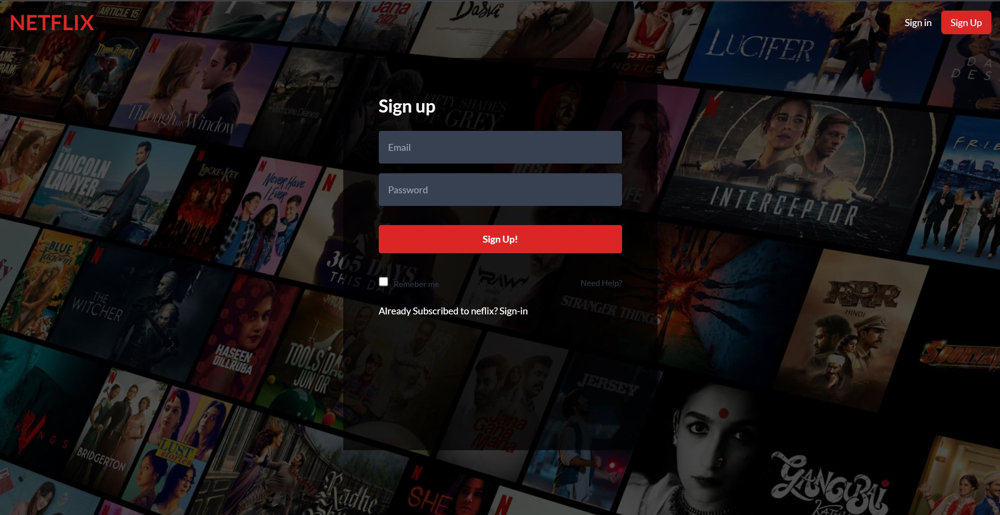
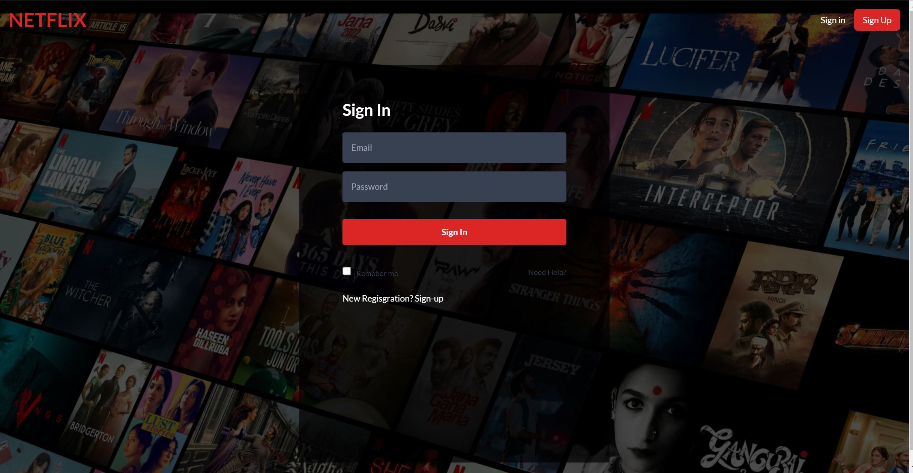
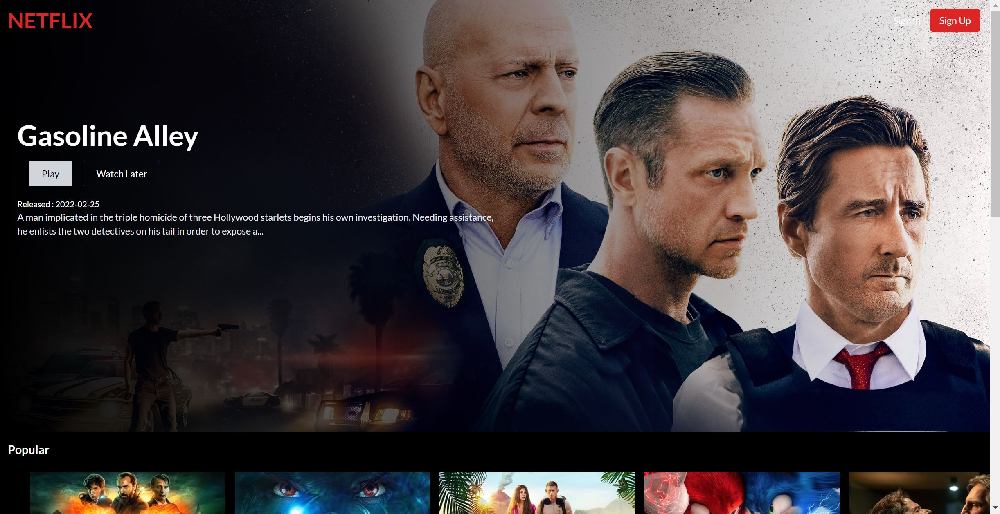
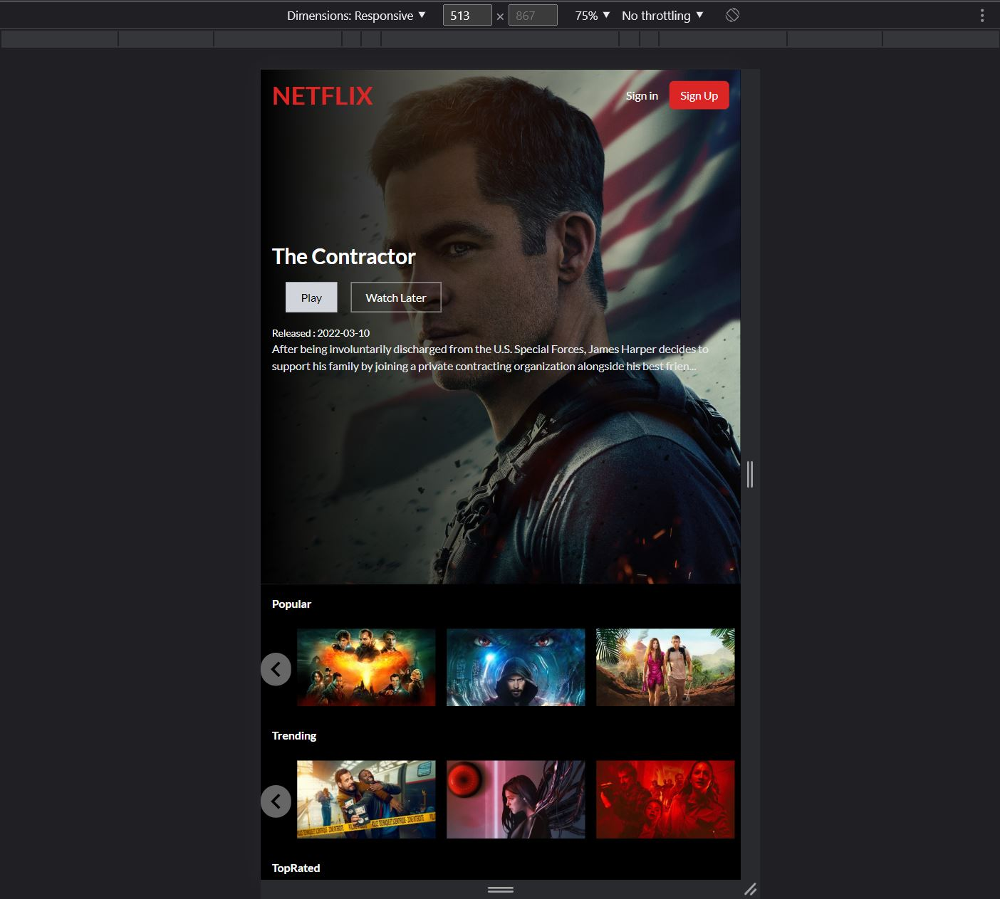
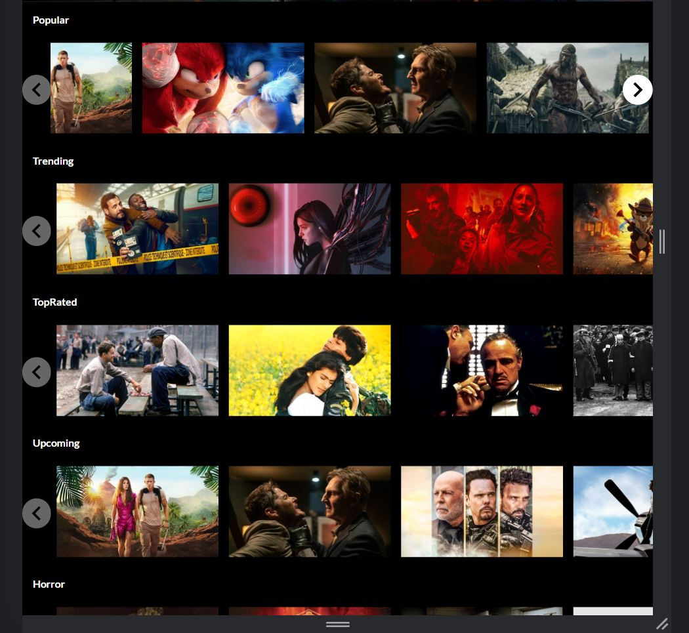
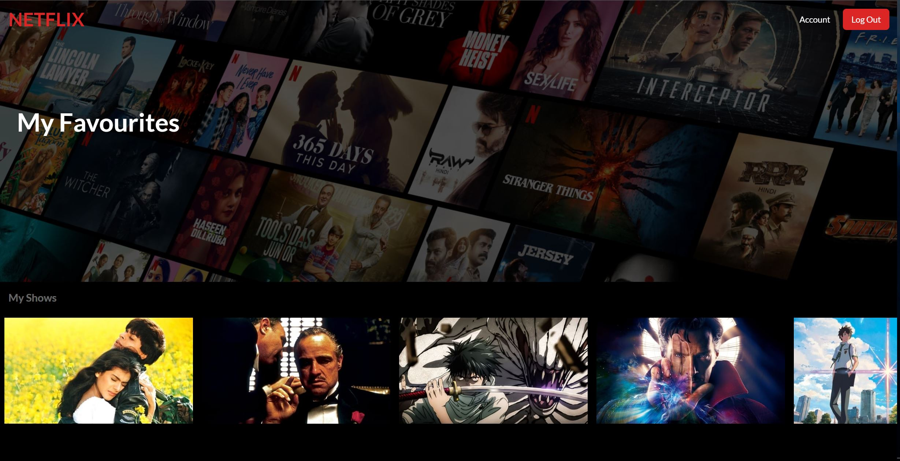
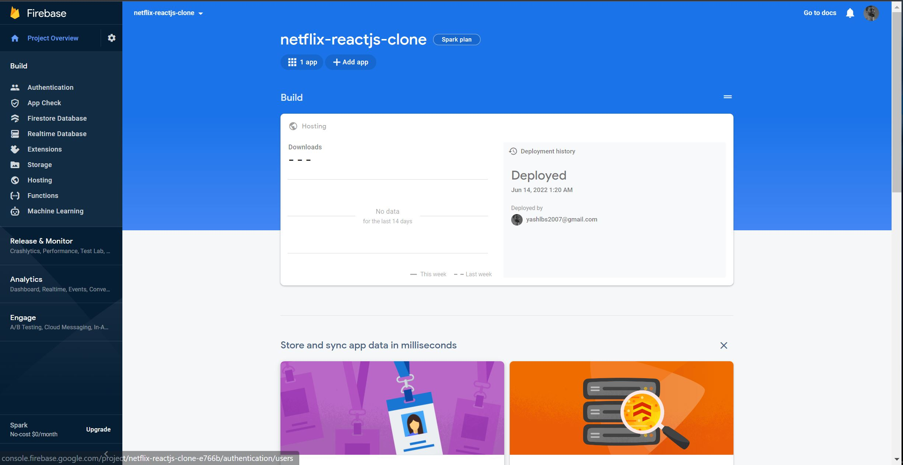

# Netflix Clone using ReactJS and Google Firebase

A Netflix Clone Built using ReactJS, TailwindCSS , Firebase and Axios to make TBDB API calls
for fetching the title, poster-path and  id of maultiple movies.

## Demo

[Firebase-Deployed-site](https://netflix-reactjs-clone-e766b.web.app/)

Login Credentials:

User: apimoneky@gmail.com

Pass: 1234567

## Documentation

[ReactJS](https://reactjs.org/docs/getting-started.html)

[TailwindCSS](https://tailwindcss.com/docs/guides/create-react-app)

[Google Firebase](https://firebase.google.com/docs/firestore/quickstart?hl=en&authuser=0#web-version-9)

[tmdb-Api](https://www.themoviedb.org/documentation/api)

## Screenshots

## 🔗 Links

## Support

If you like the work I do, show your appreciation by 'FORK', 'STAR' and 'SHARE'.

